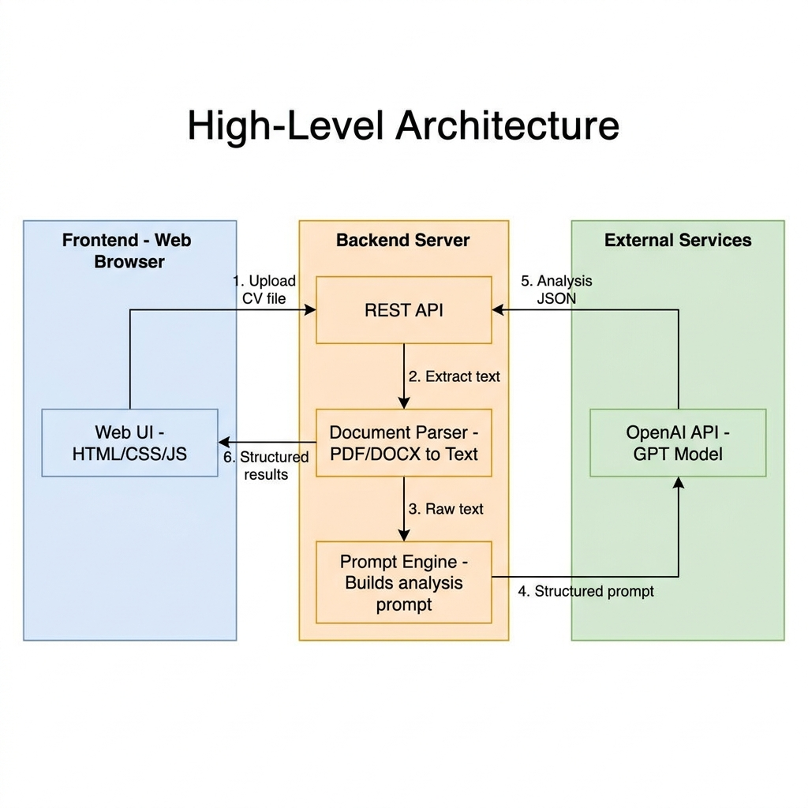
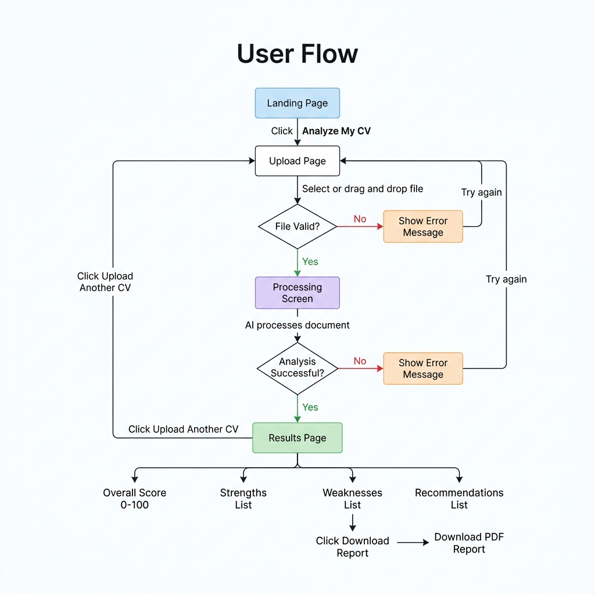

# Product Requirements Document (PRD)
# AI-Powered CV Analyzer

| Field            | Detail                          |
|------------------|---------------------------------|
| **Product Name** | CV Analyzer                     |
| **Version**      | 1.0                             |
| **Date**         | April 24, 2026                  |
| **Status**       | Draft                           |
| **Author**       | Product Team                    |

---

## 1. Project Overview

**CV Analyzer** is a web-based application that enables job seekers to upload their resume (CV) and receive an AI-generated analysis that includes an overall quality score, identified strengths, weaknesses, and actionable improvement recommendations. The application leverages OpenAI's language models to perform Natural Language Processing (NLP) on uploaded documents, delivering structured and easy-to-understand feedback within seconds.

The product is designed with simplicity at its core — a clean, intuitive interface that any user, regardless of technical skill, can use effortlessly. It serves as both a standalone personal tool and a foundation for a scalable digital product.

---

## 2. Background

### 2.1 Market Context

The job market is increasingly competitive. Job seekers often submit resumes without understanding how well their document communicates their qualifications. Professional resume review services exist but are expensive ($50–$300+) and slow (1–3 business days). Free online tools are often superficial, checking only formatting or keyword counts without understanding context.

### 2.2 Opportunity

Advances in Large Language Models (LLMs) — particularly OpenAI's GPT models — now make it possible to perform deep, contextual analysis of resume content at low cost and in real-time. This creates an opportunity to democratize high-quality resume feedback.

### 2.3 Vision

Provide every job seeker with instant, professional-grade resume feedback powered by AI — accessible, affordable, and actionable.

---

## 3. Problems & User Pain Points

| #  | Pain Point                              | Description                                                                                                    |
|----|-----------------------------------------|----------------------------------------------------------------------------------------------------------------|
| P1 | **No objective self-assessment**        | Job seekers cannot objectively evaluate the quality of their own resume — they lack an external perspective.    |
| P2 | **Unclear weaknesses**                  | Users don't know *what specifically* is weak in their resume (e.g., vague descriptions, missing metrics).       |
| P3 | **Generic advice is unhelpful**         | Most free tools give generic tips ("use action verbs") without analyzing the user's actual content.             |
| P4 | **Professional review is expensive**    | Hiring a career coach or resume writer costs $50–$300+ per session and takes days to get feedback.              |
| P5 | **Slow feedback loop**                  | Waiting days for feedback slows down the job application process when timing matters.                           |
| P6 | **Tech-savvy tools intimidate users**   | Many existing tools have complex UIs, require account creation, or push upsells before delivering value.       |

---

## 4. Solutions

| Pain Point | Solution                                                                                                           |
|------------|--------------------------------------------------------------------------------------------------------------------|
| P1         | Provide an **overall CV quality score** (0–100) so users have a clear, quantifiable benchmark.                     |
| P2         | Generate a **structured list of weaknesses** with specific references to sections/content in the uploaded resume.  |
| P3         | Deliver **personalized, actionable recommendations** based on the actual content of the user's CV.                 |
| P4         | Offer **free or low-cost** AI-powered analysis that rivals professional-grade feedback.                            |
| P5         | Return analysis results **within seconds** of uploading a document.                                                |
| P6         | Build a **minimal, clean UI** — upload and get results in two steps. No mandatory sign-up for basic usage.         |

---

## 5. High-Level Architecture



### Architecture Notes

| Component         | Technology / Tool                  | Purpose                                              |
|-------------------|------------------------------------|------------------------------------------------------|
| Frontend          | HTML, CSS, JavaScript (or React)   | User interface for upload and results display         |
| Backend API       | Node.js (Express) or Python (FastAPI) | Handles file upload, orchestration, and response   |
| Document Parser   | pdf-parse, mammoth, or PyPDF2      | Extracts plain text from PDF/DOCX files              |
| Prompt Engine     | Custom module                      | Constructs structured prompts for the LLM            |
| AI Service        | OpenAI GPT API (gpt-4o-mini)      | Performs NLP analysis and generates structured output |

---

## 6. User Flow



---

## 7. Scope

### 7.1 In Scope (v1.0)

| #   | Feature                        | Description                                                       |
|-----|--------------------------------|-------------------------------------------------------------------|
| S1  | File Upload                    | Upload a single CV file in PDF or DOCX format (max 5 MB)         |
| S2  | Document Parsing               | Extract text content from the uploaded file                       |
| S3  | AI Analysis                    | Send extracted text to OpenAI API and receive structured analysis |
| S4  | Overall Score                  | Display an overall quality score from 0 to 100                   |
| S5  | Strengths                      | Display a list of identified strengths in the CV                  |
| S6  | Weaknesses                     | Display a list of identified weaknesses in the CV                 |
| S7  | Recommendations                | Display actionable improvement suggestions                        |
| S8  | Results Display                | Show all analysis results on a single, clean results page         |
| S9  | Upload Another                 | Allow users to analyze a new CV without refreshing the page       |
| S10 | Download Report                | Export the analysis result as a downloadable PDF report           |
| S11 | Error Handling                 | Graceful handling of invalid files, API errors, and edge cases    |
| S12 | Responsive Design              | Works on desktop and mobile browsers                              |

### 7.2 Out of Scope (v1.0)

| Feature                                   | Reason                                                  |
|-------------------------------------------|---------------------------------------------------------|
| User authentication / accounts            | Keep v1 frictionless — no sign-up required              |
| CV history / storage                      | Requires user accounts and database — deferred to v2    |
| Job description matching                  | Adds complexity — planned for future iteration          |
| Multi-language CV support                 | English-only in v1 to simplify prompt engineering       |
| CV template builder                       | Different product domain — out of scope                 |
| ATS simulation                            | Complex feature — deferred to v2                        |
| Payment / subscription                    | Not needed until product-market fit is validated        |

---

## 8. User Stories

### Epic 1: CV Upload

#### US-1.1: Upload CV File

> **As a** job seeker,
> **I want to** upload my CV file from my device,
> **So that** the system can analyze my resume content.

**Acceptance Criteria:**

| #    | Criteria                                                                                     | Type       |
|------|----------------------------------------------------------------------------------------------|------------|
| AC-1 | User can select a file via a file picker dialog or drag-and-drop                             | Functional |
| AC-2 | System accepts PDF and DOCX file formats only                                                | Functional |
| AC-3 | System rejects files exceeding 5 MB with a clear error message                               | Functional |
| AC-4 | System rejects unsupported file formats with message: "Please upload a PDF or DOCX file"     | Functional |
| AC-5 | Upload button is clearly visible and labeled on the page                                     | UX         |
| AC-6 | Drag-and-drop zone is visually indicated with a dashed border and icon                       | UX         |

---

#### US-1.2: File Validation Feedback

> **As a** user,
> **I want to** see immediate feedback if my file is invalid,
> **So that** I can correct the issue and upload the right file.

**Acceptance Criteria:**

| #    | Criteria                                                                                         | Type       |
|------|--------------------------------------------------------------------------------------------------|------------|
| AC-1 | Error message appears within 1 second of file selection if the file is invalid                   | Functional |
| AC-2 | Error message is displayed inline (not as a browser alert/popup)                                 | UX         |
| AC-3 | Error message clearly states the reason for rejection (format, size, or empty file)              | UX         |
| AC-4 | User can retry upload without navigating away from the page                                      | Functional |

---

### Epic 2: CV Analysis

#### US-2.1: Analyze CV Content

> **As a** job seeker,
> **I want** the system to analyze my CV content using AI,
> **So that** I receive objective feedback on my resume quality.

**Acceptance Criteria:**

| #    | Criteria                                                                                  | Type         |
|------|-------------------------------------------------------------------------------------------|--------------|
| AC-1 | System extracts text from the uploaded PDF or DOCX file                                   | Functional   |
| AC-2 | Extracted text is sent to OpenAI API for analysis                                         | Functional   |
| AC-3 | Analysis is completed and results are displayed within 30 seconds                         | Performance  |
| AC-4 | A loading/progress indicator is shown while analysis is in progress                       | UX           |
| AC-5 | User cannot upload another file while analysis is in progress                             | Functional   |

---

#### US-2.2: View Overall Score

> **As a** job seeker,
> **I want to** see an overall quality score for my CV,
> **So that** I have a quick, quantifiable sense of my resume quality.

**Acceptance Criteria:**

| #    | Criteria                                                                                  | Type       |
|------|-------------------------------------------------------------------------------------------|------------|
| AC-1 | Score is displayed as a number from 0 to 100                                              | Functional |
| AC-2 | Score is visually prominent (large font, centered) on the results page                    | UX         |
| AC-3 | Score includes a color indicator: red (0–39), yellow (40–69), green (70–100)              | UX         |
| AC-4 | A brief label accompanies the score (e.g., "Needs Work", "Good", "Excellent")             | UX         |

---

#### US-2.3: View Strengths

> **As a** job seeker,
> **I want to** see a list of strengths identified in my CV,
> **So that** I know what I am doing well and should keep.

**Acceptance Criteria:**

| #    | Criteria                                                                                  | Type       |
|------|-------------------------------------------------------------------------------------------|------------|
| AC-1 | Strengths are displayed as a bulleted list with 3–7 items                                 | Functional |
| AC-2 | Each strength item is a specific observation (not generic advice)                          | Quality    |
| AC-3 | Strengths section is clearly labeled with a green accent or icon                          | UX         |

---

#### US-2.4: View Weaknesses

> **As a** job seeker,
> **I want to** see a list of weaknesses found in my CV,
> **So that** I know exactly what to improve.

**Acceptance Criteria:**

| #    | Criteria                                                                                  | Type       |
|------|-------------------------------------------------------------------------------------------|------------|
| AC-1 | Weaknesses are displayed as a bulleted list with 3–7 items                                | Functional |
| AC-2 | Each weakness item references a specific issue in the CV content                           | Quality    |
| AC-3 | Weaknesses section is clearly labeled with a red/orange accent or icon                    | UX         |

---

#### US-2.5: View Recommendations

> **As a** job seeker,
> **I want to** receive actionable recommendations to improve my CV,
> **So that** I can make concrete changes to strengthen my resume.

**Acceptance Criteria:**

| #    | Criteria                                                                                                            | Type       |
|------|---------------------------------------------------------------------------------------------------------------------|------------|
| AC-1 | Recommendations are displayed as a numbered list with 3–7 items                                                     | Functional |
| AC-2 | Each recommendation is specific and actionable (e.g., "Add metrics to your Sales Manager bullet points")            | Quality    |
| AC-3 | Recommendations are prioritized from most impactful to least                                                        | Quality    |
| AC-4 | Recommendations section is clearly labeled with a blue accent or icon                                               | UX         |

---

### Epic 3: Results Management

#### US-3.1: Download Analysis Report

> **As a** job seeker,
> **I want to** download my analysis results as a PDF,
> **So that** I can save and reference them offline while improving my CV.

**Acceptance Criteria:**

| #    | Criteria                                                                                  | Type       |
|------|-------------------------------------------------------------------------------------------|------------|
| AC-1 | A "Download Report" button is visible on the results page                                 | Functional |
| AC-2 | Clicking the button generates and downloads a PDF file                                    | Functional |
| AC-3 | The PDF contains: score, strengths, weaknesses, and recommendations                       | Functional |
| AC-4 | The PDF is cleanly formatted and readable                                                 | Quality    |
| AC-5 | The file is named with a recognizable pattern (e.g., CV_Analysis_Report_2026-04-24.pdf)   | UX         |

---

#### US-3.2: Analyze Another CV

> **As a** user,
> **I want to** upload and analyze another CV after viewing results,
> **So that** I can compare different versions of my resume or help others.

**Acceptance Criteria:**

| #    | Criteria                                                                                  | Type       |
|------|-------------------------------------------------------------------------------------------|------------|
| AC-1 | An "Upload Another CV" button is visible on the results page                              | Functional |
| AC-2 | Clicking the button navigates back to the upload screen                                   | Functional |
| AC-3 | Previous results are cleared from the display                                             | Functional |
| AC-4 | No page reload is required (smooth transition)                                            | UX         |

---

### Epic 4: Error Handling

#### US-4.1: Handle Analysis Failure

> **As a** user,
> **I want to** see a clear error message if the analysis fails,
> **So that** I understand what went wrong and can try again.

**Acceptance Criteria:**

| #    | Criteria                                                                                  | Type       |
|------|-------------------------------------------------------------------------------------------|------------|
| AC-1 | If the OpenAI API returns an error, the user sees a friendly message (not a raw error)    | Functional |
| AC-2 | Error message includes a "Try Again" button                                               | UX         |
| AC-3 | System logs the actual error for debugging (server-side)                                  | Technical  |
| AC-4 | If the file content is unreadable/empty, the user is informed to upload a different file   | Functional |

---

#### US-4.2: Handle Network Issues

> **As a** user,
> **I want** the application to handle slow or failed network connections gracefully,
> **So that** I do not lose my progress or see confusing errors.

**Acceptance Criteria:**

| #    | Criteria                                                                                  | Type       |
|------|-------------------------------------------------------------------------------------------|------------|
| AC-1 | If the upload request times out after 60 seconds, show a timeout error message            | Functional |
| AC-2 | If the analysis request times out after 60 seconds, show a timeout error message          | Functional |
| AC-3 | User can retry without re-selecting the file                                              | UX         |

---

## 9. Non-Functional Requirements

| #    | Requirement                | Target                                                         |
|------|----------------------------|----------------------------------------------------------------|
| NFR-1| Response Time              | Analysis results returned within 30 seconds                    |
| NFR-2| File Size Limit            | Maximum upload size: 5 MB                                      |
| NFR-3| Browser Support            | Chrome, Firefox, Safari, Edge (latest 2 versions)              |
| NFR-4| Mobile Responsive          | Fully usable on screens >= 320px width                         |
| NFR-5| Accessibility              | WCAG 2.1 Level AA compliance for core flows                    |
| NFR-6| Data Privacy               | Uploaded files are not stored after analysis; processed in-memory only |
| NFR-7| API Key Security           | OpenAI API key is stored server-side only; never exposed to client |
| NFR-8| Availability               | 99% uptime target for MVP                                      |

---

## 10. UI/UX Design Principles

| Principle                    | Guideline                                                                           |
|------------------------------|-------------------------------------------------------------------------------------|
| Simplicity First             | Maximum 2 steps to get results: upload then view results                            |
| No Sign-Up Wall              | Users can analyze a CV without creating an account                                  |
| Clear Visual Hierarchy       | Score is the hero element; strengths, weaknesses, and recommendations follow below  |
| Friendly Language            | Avoid jargon; use plain English that non-tech users understand                      |
| Mobile-Friendly              | Touch-friendly buttons, readable fonts, no horizontal scrolling                     |
| Minimal Cognitive Load       | One primary action per screen; no cluttered sidebars or nav menus                   |

### Wireframe Concept (3 Screens)

```
LANDING PAGE
+------------------------------+
|                              |
|    CV Analyzer               |
|    Get instant AI feedback   |
|    on your resume            |
|                              |
|   +----------------------+   |
|   |  [ Analyze My CV ] --+   |
|   +----------------------+   |
+------------------------------+

UPLOAD PAGE
+------------------------------+
|                              |
|   + - - - - - - - - - - +   |
|   | Drag and drop your   |   |
|   | CV here, or click    |   |
|   | to browse            |   |
|   |                      |   |
|   | PDF or DOCX, max 5MB |   |
|   + - - - - - - - - - - +   |
|                              |
|   [ Back ]    [ Upload ]     |
+------------------------------+

RESULTS PAGE
+------------------------------+
|                              |
|          Score: 72           |
|          "Good"              |
|                              |
|  Strengths                   |
|  * Clear work experience     |
|  * Strong action verbs       |
|                              |
|  Weaknesses                  |
|  * Missing quantifiable      |
|    achievements              |
|  * No summary section        |
|                              |
|  Recommendations             |
|  1. Add metrics to bullets   |
|  2. Include a professional   |
|     summary at the top       |
|                              |
|  [Download]  [Upload Another]|
+------------------------------+
```

---

## 11. Success Metrics

| Metric                        | Target (v1.0 First 3 Months)      |
|-------------------------------|-----------------------------------|
| CVs analyzed per month        | 500+                              |
| Average analysis time         | Less than 15 seconds              |
| User satisfaction (feedback)  | 4.0+ / 5.0                        |
| Error rate                    | Less than 5% of upload attempts   |
| Report download rate          | Greater than 30% of analyses      |

---

## 12. Release Plan

| Phase        | Milestone                        | Timeline     |
|--------------|----------------------------------|--------------|
| Phase 1      | Backend API + Document Parsing   | Week 1-2     |
| Phase 2      | OpenAI Integration + Prompt Eng  | Week 2-3     |
| Phase 3      | Frontend UI (Upload + Results)   | Week 3-4     |
| Phase 4      | PDF Report Download              | Week 4       |
| Phase 5      | Testing, Bug Fixes, Polish       | Week 5       |
| Launch       | Public release (v1.0)            | Week 6       |

---

## Appendix A: API Response Structure (Expected)

```json
{
  "score": 72,
  "label": "Good",
  "strengths": [
    "Clear chronological work history with relevant job titles",
    "Effective use of action verbs in experience descriptions",
    "Education section is well-structured with relevant details"
  ],
  "weaknesses": [
    "Bullet points lack quantifiable achievements and metrics",
    "No professional summary or objective statement at the top",
    "Skills section is missing or not prominently placed"
  ],
  "recommendations": [
    "Add specific numbers and percentages to your achievement descriptions (e.g., Increased sales by 25%)",
    "Include a 2-3 sentence professional summary at the top of your CV highlighting your key qualifications",
    "Create a dedicated skills section listing both technical and soft skills relevant to your target role",
    "Ensure consistent formatting across all sections (font size, bullet style, date alignment)"
  ]
}
```

---

## Appendix B: Glossary

| Term   | Definition                                                              |
|--------|-------------------------------------------------------------------------|
| CV     | Curriculum Vitae — a document summarizing a person's qualifications     |
| NLP    | Natural Language Processing — AI techniques for understanding text      |
| LLM    | Large Language Model — AI model trained on text data (e.g., GPT)        |
| ATS    | Applicant Tracking System — software used by employers to filter CVs    |
| API    | Application Programming Interface — a way for systems to communicate    |

---

*End of Document*
