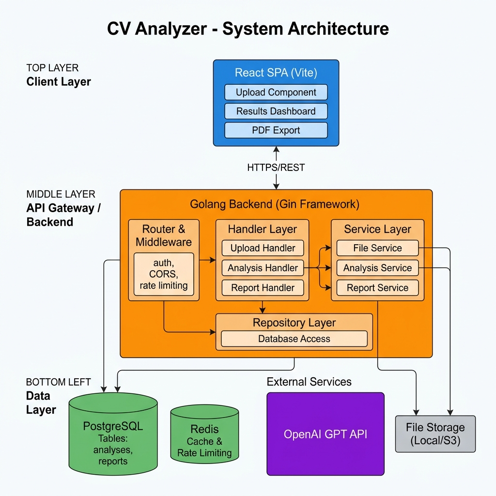
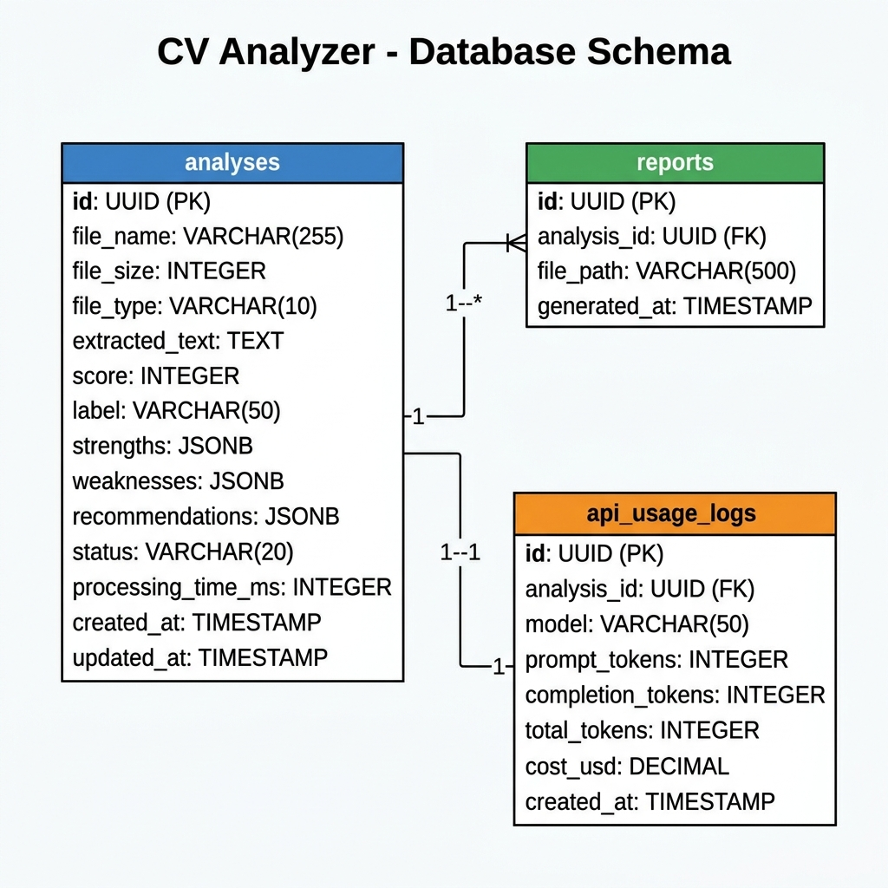
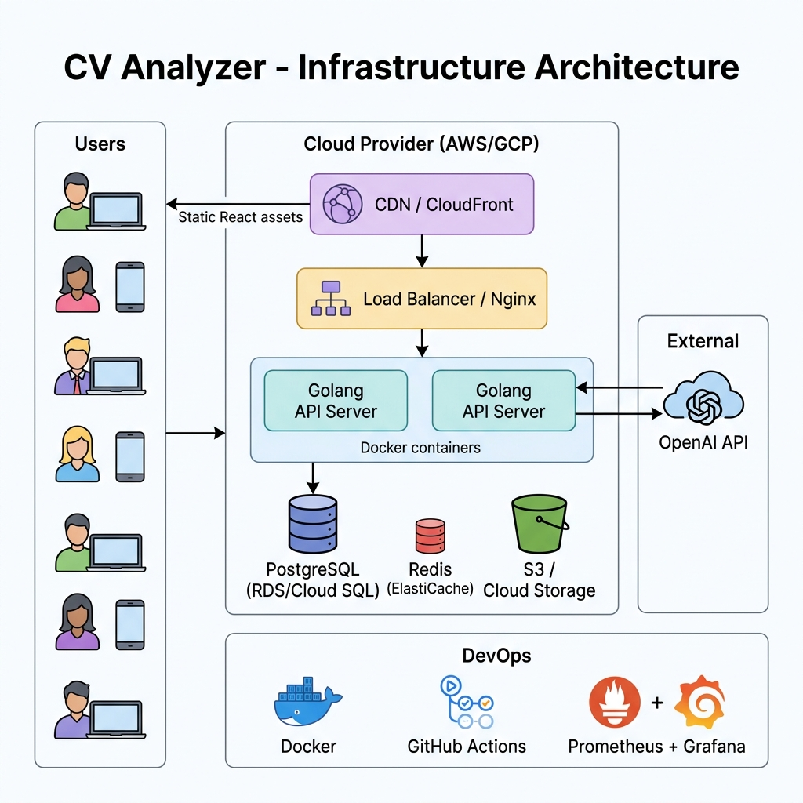
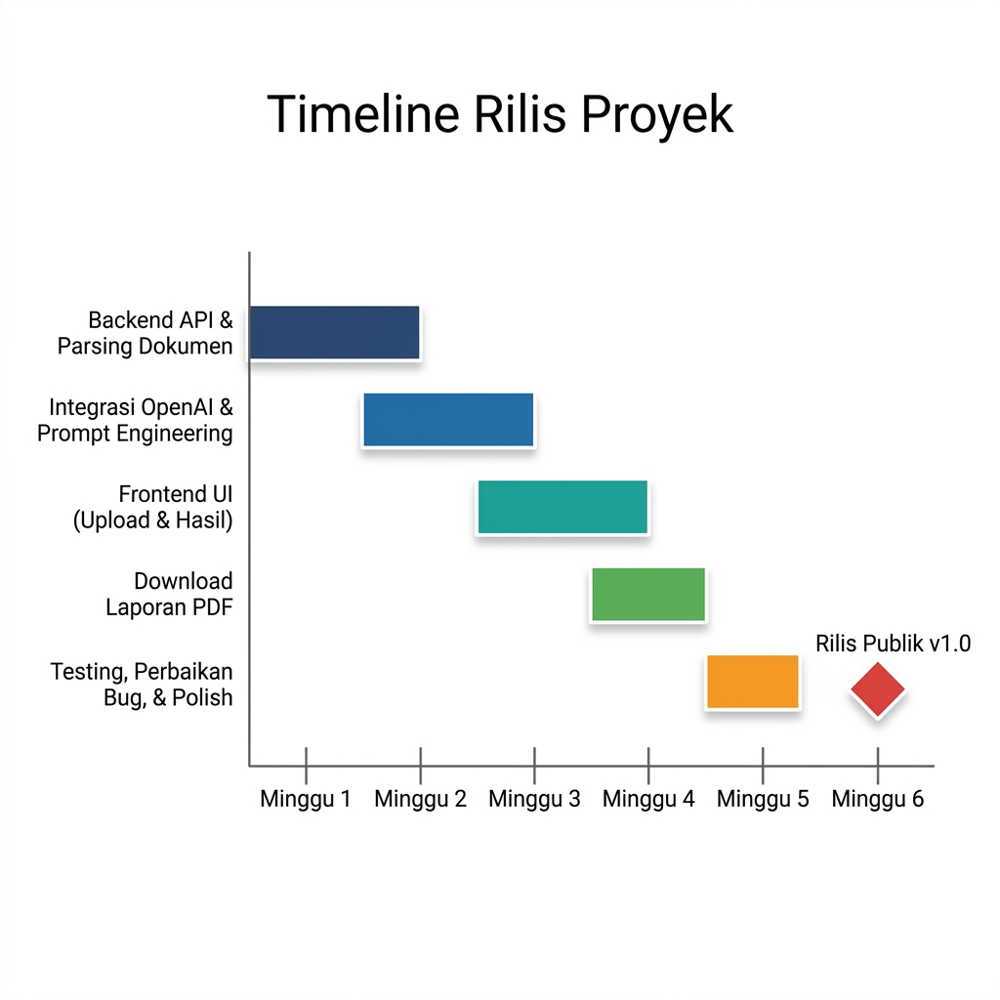

# Dokumen Arsitektur Teknis & Infrastruktur
# CV Analyzer v1.0

---

## 1. Ringkasan Eksekutif

Dokumen ini menjabarkan rancangan arsitektur sistem, desain teknis, serta kebutuhan infrastruktur untuk aplikasi **CV Analyzer** versi 1.0 yang mengacu pada Dokumen Kebutuhan Produk (PRD). Sistem ini dirancang untuk memberikan analisis CV secara real-time menggunakan kecerdasan buatan Google Gemini, dengan mengedepankan kesederhanaan, performa tinggi, dan skalabilitas.

---

## 2. Tumpukan Teknologi (Technology Stack)

| Komponen | Teknologi | Fungsi |
| :--- | :--- | :--- |
| **Antarmuka Pengguna** | React + Vite + Tailwind CSS | Membangun tampilan web yang cepat, responsif, dan minimalis |
| **Server Utama (API)** | Golang (Gin/Fiber) | Menangani unggahan file, orkestrasi proses, dan komunikasi antar layanan |
| **Basis Data** | SQL Server | Menyimpan metadata analisis, catatan penggunaan, dan log kesalahan |
| **Layanan AI** | Python (FastAPI) | Mengekstrak teks dari dokumen dan menyusun prompt untuk model AI |
| **Otomasi Alur Kerja** | n8n | Manajemen pipeline otomatis (opsional di v1) |
| **Model Bahasa** | Google Gemini Flash API | Melakukan pemrosesan bahasa alami untuk evaluasi CV |

---

## 3. Desain Arsitektur Sistem

Arsitektur ini dirancang agar dokumen yang diunggah diproses sepenuhnya di dalam memori (tanpa menyimpan ke disk), sehingga menjaga privasi pengguna sekaligus memastikan kecepatan pemrosesan.



### Alur Data

1. **Pengguna** mengunggah file PDF/DOCX (maks. 5MB) ke **Server Golang**
2. **Server Golang** meneruskan buffer file ke **Layanan AI Python**
3. **Layanan Python** mengekstrak teks dari dokumen (di dalam memori, tanpa tulis ke disk)
4. **Layanan Python** mengirimkan prompt terstruktur ke **Google Gemini API**
5. **Gemini** mengembalikan hasil analisis dalam format JSON → **Layanan Python**
6. **Layanan Python** mengembalikan hasil yang sudah diproses → **Server Golang**
7. **Server Golang** mencatat transaksi ke **SQL Server**
8. **Server Golang** mengirimkan respons JSON ke **Pengguna**

---

## 4. Spesifikasi Komponen

### 4.1. Antarmuka Pengguna (React + Vite)

| Aspek | Detail |
|---|---|
| Manajemen State | React Context atau Zustand (kebutuhan state minimal) |
| Styling | Tailwind CSS untuk pengembangan UI responsif yang cepat |
| Navigasi | React Router (Halaman Utama, Halaman Unggah, Halaman Hasil) |
| Unggah File | Drag-and-drop HTML5 bawaan dengan validasi sebelum unggah |
| Ekspor PDF | Pembuatan PDF di sisi klien menggunakan `jspdf` |

### 4.2. Server Utama (Golang)

| Aspek | Detail |
|---|---|
| Framework | `Gin` atau `Fiber` untuk throughput tinggi |
| Penanganan File | Multipart/form-data dengan validasi ukuran & tipe MIME |
| Keamanan | Pembatasan laju akses (rate limiting), CORS, perlindungan DDoS |
| Komunikasi Internal | HTTP atau gRPC ke Layanan AI Python |
| Pencatatan Log | Log transaksi anonim ke SQL Server |
| Pembuatan Laporan | `gofpdf` atau `unidoc` untuk pembuatan PDF di sisi server |

### 4.3. Layanan AI (Python)

| Aspek | Detail |
|---|---|
| Framework | FastAPI (asinkron) |
| Pustaka | `PyPDF2`, `python-docx`, `google-generativeai` SDK |
| Ekstraksi Teks | Sepenuhnya di memori — tidak ada penulisan ke disk |
| Penanganan Error | Exponential backoff untuk rate limit Gemini API |
| Validasi | Validasi skema pada respons JSON dari Gemini |

---

## 5. Skema Basis Data (SQL Server)

> **Catatan Privasi (NFR-6):** File yang diunggah dan teks yang diekstrak **tidak pernah** disimpan ke basis data. Basis data hanya digunakan untuk telemetri, analitik, dan pelacakan kesalahan guna mengukur metrik keberhasilan yang tertera di PRD.



```sql
-- Tabel: AnalysisLogs (Catatan Analisis)
CREATE TABLE AnalysisLogs (
    LogID UNIQUEIDENTIFIER PRIMARY KEY DEFAULT NEWID(),
    Timestamp DATETIME DEFAULT GETUTCDATE(),
    FileSizeKB INT NOT NULL,
    FileType VARCHAR(10) NOT NULL, -- 'PDF' atau 'DOCX'
    ProcessingTimeMs INT NOT NULL,
    OverallScore INT,
    Status VARCHAR(20) NOT NULL, -- 'SUCCESS', 'FAILED_PARSING', 'FAILED_AI', 'TIMEOUT'
    ErrorMessage NVARCHAR(MAX) NULL
);

-- Tabel: ApiUsageLogs (Catatan Penggunaan API)
CREATE TABLE ApiUsageLogs (
    LogID UNIQUEIDENTIFIER PRIMARY KEY DEFAULT NEWID(),
    AnalysisLogID UNIQUEIDENTIFIER FOREIGN KEY REFERENCES AnalysisLogs(LogID),
    Model VARCHAR(50) NOT NULL,
    PromptTokens INT,
    CompletionTokens INT,
    TotalTokens INT,
    CostUSD DECIMAL(10,6),
    CreatedAt DATETIME DEFAULT GETUTCDATE()
);
```

---

## 6. Antarmuka API

### 6.1. Endpoint Analisis CV

**`POST /api/v1/analyze`**
- **Content-Type**: `multipart/form-data`
- **Payload**: `file` (file biner PDF/DOCX)
- **Respons Sukses (200 OK)**:
```json
{
  "status": "success",
  "data": {
    "score": 72,
    "label": "Bagus",
    "strengths": ["Riwayat kerja kronologis yang jelas..."],
    "weaknesses": ["Kurang memiliki pencapaian terukur..."],
    "recommendations": ["Tambahkan angka spesifik ke deskripsi pencapaian..."]
  },
  "processing_time_ms": 4250
}
```
- **Respons Gagal**: `400` (file tidak valid), `413` (ukuran file melebihi batas), `500` (kesalahan server), `504` (waktu habis)

### 6.2. Endpoint Unduh Laporan

**`POST /api/v1/report/generate`**
- **Content-Type**: `application/json`
- **Payload**: Objek JSON yang sesuai dengan `data` dari respons `/analyze`
- **Respons (200 OK)**: Stream biner `application/pdf`

### 6.3. Pemeriksaan Kesehatan Sistem

**`GET /api/v1/health`**
- **Respons**: `{ "status": "ok", "version": "1.0.0", "uptime": "..." }`

---

## 7. Kebutuhan Infrastruktur



Target: ~500+ analisis per bulan, biaya rendah, uptime 99%.

### 7.1. Sumber Daya Komputasi (Kontainerisasi Docker)

| Layanan | Spesifikasi | Rekomendasi Layanan Cloud |
| :--- | :--- | :--- |
| **Frontend** | Hosting statis | Vercel / Cloudflare Pages / S3+CloudFront |
| **Server Golang** | 1 vCPU, 1 GB RAM | Google Cloud Run / AWS App Runner / VPS |
| **Layanan AI Python** | 1 vCPU, 2 GB RAM | Google Cloud Run (butuh memori lebih untuk parsing PDF) |

### 7.2. Basis Data

- **SQL Server**: Instans terkelola (managed instance) tingkat dasar
- **Spesifikasi**: 1 vCPU, 1 GB RAM, 10 GB penyimpanan
- **Pilihan**: Azure SQL Database Basic Tier / AWS RDS SQL Server Express

### 7.3. Jaringan & Keamanan

| Aspek | Kebutuhan |
|---|---|
| Domain & SSL | Domain kustom dengan terminasi TLS 1.2+ |
| WAF | Firewall aplikasi web dasar (Cloudflare free tier atau setara) |
| Jaringan Internal | Komunikasi Golang ↔ Python melalui VPC privat |
| Akses Publik | Hanya Server Golang yang terbuka ke internet |

### 7.4. Manajemen Rahasia (Secrets)

| Variabel | Penyimpanan |
|---|---|
| `GEMINI_API_KEY` | AWS Secrets Manager / GCP Secret Manager |
| `DB_CONNECTION_STRING` | Variabel lingkungan (terenkripsi) |
| `PYTHON_SERVICE_URL` | Service discovery internal |

### 7.5. Pipeline CI/CD

1. **Pull Request**: Linting & pengujian unit otomatis
2. **Merge ke `main`**: Build image Docker
3. **Deploy otomatis**: Staging → Produksi

---

## 8. Keamanan & Privasi Data

| # | Langkah Pengamanan | Implementasi |
|---|---|---|
| 1 | Kebijakan Tanpa Penyimpanan | File dibaca ke `bytes.Buffer`, lalu dihapus otomatis oleh garbage collector setelah diproses |
| 2 | Validasi File | Pengecekan tipe MIME dan Magic Number di Golang sebelum file diproses |
| 3 | Perlindungan Kunci API | Kunci Gemini hanya tersimpan di sisi server; tidak pernah terekspos ke frontend |
| 4 | Sanitasi Input | Teks disanitasi sebelum disusun menjadi prompt |
| 5 | Pembatasan Laju Akses | Throttling per alamat IP untuk mencegah penyalahgunaan |

---

## 9. Pemantauan & Observabilitas

| Alat | Fungsi |
|---|---|
| **Prometheus** | Pengumpulan metrik (latensi request, tingkat kesalahan) |
| **Grafana** | Dashboard visualisasi & sistem peringatan |
| **Structured Logging** | Log terstruktur JSON menggunakan `zerolog` (Go) / `loguru` (Python) |

### Metrik Utama yang Dipantau

- Latensi permintaan (p50, p95, p99)
- Waktu respons & tingkat kesalahan Gemini API
- Rasio keberhasilan/kegagalan unggah file
- Distribusi skor analisis
- Jumlah analisis harian dan mingguan

---

## 10. Timeline Proyek



| Fase | Pencapaian | Jadwal | Penanggung Jawab |
|---|---|---|---|
| Fase 1 | Backend API + Penguraian Dokumen | Minggu 1–2 | Tim Backend |
| Fase 2 | Integrasi Gemini + Penyusunan Prompt | Minggu 2–3 | Tim AI/Backend |
| Fase 3 | Antarmuka Frontend (Unggah + Hasil) | Minggu 3–4 | Tim Frontend |
| Fase 4 | Fitur Unduh Laporan PDF | Minggu 4 | Full Stack |
| Fase 5 | Pengujian, Perbaikan Bug, Pemolesan | Minggu 5 | QA + Seluruh Tim |
| Peluncuran | Rilis Publik (v1.0) | Minggu 6 | Seluruh Tim |

---

## 11. Estimasi Biaya Bulanan

| Item | Perkiraan Biaya |
|---|---|
| Hosting Frontend (Vercel/CF) | Gratis – $20 |
| Server Golang (Cloud Run / VPS) | $5 – $25 |
| Layanan AI Python (Cloud Run) | $5 – $25 |
| SQL Server (Tier Dasar) | $5 – $15 |
| Gemini API (~500 analisis) | $2 – $10 |
| Domain + SSL | $1 – $5 |
| **Total** | **~$18 – $100/bulan** |

---

## 12. Risiko & Mitigasi

| Risiko | Dampak | Langkah Mitigasi |
|---|---|---|
| Gangguan layanan Gemini API | Analisis tidak tersedia | Logika percobaan ulang otomatis + pesan kesalahan yang ramah pengguna |
| Unggahan file berbahaya | Potensi pelanggaran keamanan | Validasi magic number + pembatasan ukuran file + WAF |
| Latensi tinggi (>30 detik) | Pengalaman pengguna buruk | Pemrosesan asinkron + penanganan timeout + caching |
| Pembengkakan biaya API | Melebihi anggaran | Pemantauan penggunaan token + pembatasan laju per pengguna |
| Pelanggaran privasi data | Risiko hukum | Kebijakan tanpa penyimpanan + tidak ada data pribadi di basis data |

---

*Akhir Dokumen*
