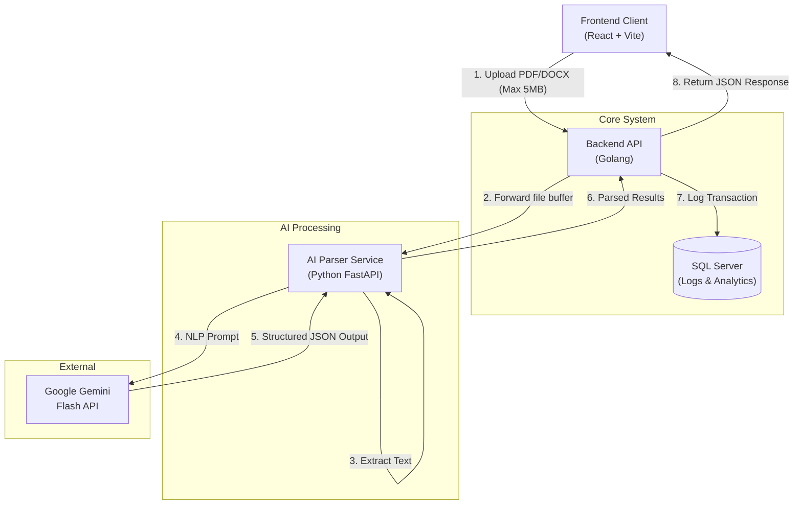

# CV Analyzer - Technical Architecture & Infrastructure Document

## 1. Executive Summary
This document outlines the technical architecture, system design, and infrastructure requirements for the **CV Analyzer** application (v1.0), based on the provided Product Requirements Document (PRD). The system is designed to provide real-time, AI-powered CV analysis using Google Gemini, emphasizing simplicity, high performance, and scalability.

---

## 2. Technology Stack
Based on the PRD, the application utilizes a microservices-oriented architecture with the following stack:

| Component | Technology | Purpose |
| :--- | :--- | :--- |
| **Frontend** | React + Vite + Tailwind CSS | Fast, responsive, and minimalist user interface. |
| **Core Backend (API)**| Golang | High-performance API server to handle uploads and orchestration. |
| **Database** | SQL Server | Storing application metadata, usage analytics, and error logs (no PII or CV files stored in v1). |
| **AI Service** | Python (FastAPI) | Document parsing (PyPDF2/python-docx) and AI prompt engineering. |
| **Workflow / Orchestration** | n8n | Automated pipeline management (optional for v1, but supported). |
| **External LLM** | Google Gemini Flash API | Natural Language Processing for CV evaluation. |

---

## 3. System Architecture Design

The architecture is designed to handle document uploads securely, process them entirely in memory, and interact with external AI services asynchronously.



---

## 4. Component Specifications

### 4.1. Frontend (React + Vite)
- **State Management**: React Context or Zustand (minimal state needed).
- **Styling**: Tailwind CSS for rapid, responsive UI development.
- **Routing**: React Router (Main Page, Upload view, Results view).
- **File Upload**: Native HTML5 Drag-and-Drop with pre-upload validation (File type, Size < 5MB).

### 4.2. Core Backend (Golang)
- **Framework**: Standard library `net/http` or lightweight router like `Gin` / `Echo` or `Fiber` for high throughput.
- **Responsibilities**:
  - Receive and validate multipart/form-data requests.
  - Rate limiting and basic DDoS protection.
  - Forward files securely to the AI Python Service via internal gRPC or HTTP.
  - Insert anonymized transaction logs into SQL Server.
  - PDF Report Generation (using libraries like `gofpdf` or `unidoc`).

### 4.3. AI Parsing Service (Python)
- **Framework**: FastAPI (async Python).
- **Libraries**: `PyPDF2`, `python-docx` for text extraction. `google-generativeai` SDK.
- **Responsibilities**:
  - Extract text safely without saving to disk.
  - Sanitize and format the prompt.
  - Handle Gemini API rate limits and retries (Exponential backoff).
  - Parse Gemini's JSON response and ensure schema validity.

---

## 5. Database Schema (SQL Server)
*Note: In accordance with NFR-6 (Data Privacy), uploaded files and extracted text are NEVER saved to the database. The database is strictly for telemetry, analytics, and error tracking to measure "Success Metrics" from the PRD.*

```sql
-- Table: AnalysisLogs
CREATE TABLE AnalysisLogs (
    LogID UNIQUEIDENTIFIER PRIMARY KEY DEFAULT NEWID(),
    Timestamp DATETIME DEFAULT GETUTCDATE(),
    FileSizeKB INT NOT NULL,
    FileType VARCHAR(10) NOT NULL, -- 'PDF' or 'DOCX'
    ProcessingTimeMs INT NOT NULL,
    OverallScore INT,
    Status VARCHAR(20) NOT NULL, -- 'SUCCESS', 'FAILED_PARSING', 'FAILED_AI', 'TIMEOUT'
    ErrorMessage NVARCHAR(MAX) NULL
);
```

---

## 6. API Interfaces

### 6.1. Analyze CV Endpoint
**`POST /api/v1/analyze`**
- **Content-Type**: `multipart/form-data`
- **Payload**: `file` (Binary PDF/DOCX)
- **Response (200 OK)**:
```json
{
  "status": "success",
  "data": {
    "score": 72,
    "label": "Bagus",
    "strengths": ["..."],
    "weaknesses": ["..."],
    "recommendations": ["..."]
  },
  "processing_time_ms": 4250
}
```

### 6.2. Download Report Endpoint
**`POST /api/v1/report/generate`**
- **Content-Type**: `application/json`
- **Payload**: JSON matching the `data` object from the `/analyze` response.
- **Response (200 OK)**: `application/pdf` binary stream.

---

## 7. Infrastructure Request (Infra Request)

To deploy the CV Analyzer v1.0, the following infrastructure components are requested to support the target of ~500+ analyses/month, keeping costs low while ensuring 99% uptime.

### 7.1. Compute Resources (Containerized via Docker)
| Service | Resource Specs | Recommended Cloud Service (AWS/GCP/Azure) |
| :--- | :--- | :--- |
| **Frontend** | Static Hosting | Vercel, Cloudflare Pages, or AWS S3 + CloudFront |
| **Golang API** | 1 vCPU, 1 GB RAM | Google Cloud Run, AWS App Runner, or basic VPS |
| **Python AI Svc** | 1 vCPU, 2 GB RAM | Google Cloud Run (to handle memory-intensive PDF parsing) |

### 7.2. Database
- **SQL Server Instance**: A basic managed instance.
- **Specs**: 1 vCPU, 1 GB RAM, 10 GB Storage (e.g., Azure SQL Database Basic Tier or AWS RDS SQL Server Express).

### 7.3. Network & Security
- **Domain & SSL**: Custom domain with TLS 1.2+ termination.
- **WAF**: Basic Web Application Firewall to block malicious file uploads and enforce rate limiting (e.g., Cloudflare free tier).
- **Internal Network**: The Golang API and Python Service should communicate over a private VPC; only the Golang API is exposed to the internet.

### 7.4. External APIs & Secrets Management
- **Google Gemini API Key**: Stored securely in a Secrets Manager (e.g., AWS Secrets Manager, GCP Secret Manager, or Doppler).
- **Environment Variables**:
  - `GEMINI_API_KEY`
  - `DB_CONNECTION_STRING`
  - `PYTHON_SERVICE_URL`

### 7.5. CI/CD Pipeline
- **Repository**: GitHub or GitLab.
- **Actions**:
  1. Linting & Unit tests on PR.
  2. Build Docker images on merge to `main`.
  3. Deploy to Staging/Production automatically.

---

## 8. Security & Privacy Compliance
1. **Zero-Retention Policy**: Files are read into a memory buffer (`bytes.Buffer`), sent to the AI service, and garbage-collected immediately. No disk writes.
2. **File Validation**: Strict MIME-type checking and Magic Number verification in Golang before processing to prevent malicious file execution.
3. **API Key Protection**: The Gemini API key is never exposed to the frontend. All AI interactions occur via the backend Python service.
